## Estrutura da Apresentação

 
 

1.  **Imagem de Sensoriamento Remoto**

 

2.  **Dados PolSAR**

 

3.  **Modelagem de dados PolSAR**

 

4.  **Resultados e Conclusões**

---

## Introdução

<!-- Antes de tudo vamos entender o que é um radar e sua importância nesta tese.
-->

* **RADAR** é um acrônimo de *Radio Detection and Ranging*

* Ele é baseado nos princípios de propagação eletromagnética, em que uma onda
eletromagnética é emitida por uma fonte e é retroespalhada para o radar

* Uma imagem de radar é o resultado de uma interação entre a energia emitida
  pelo radar e o objeto sob estudo, e a aparência da imagem é influenciada
  pela forma e a textura do alvo;

 

:::: {.columns}

::: {.column width="50%"}

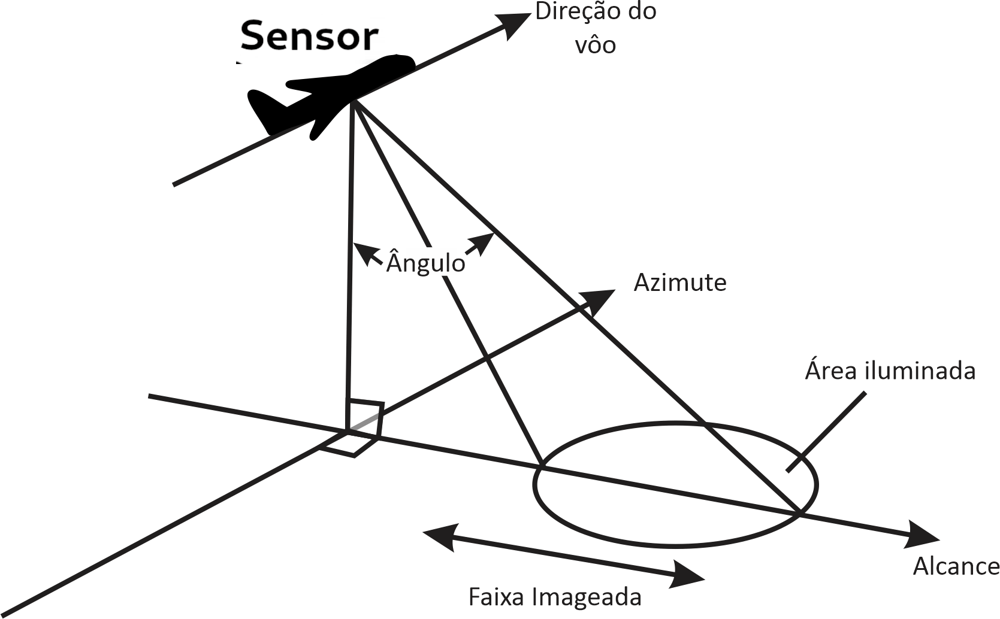{.relative width="70%"}

:::
::: {.column width="50%"}

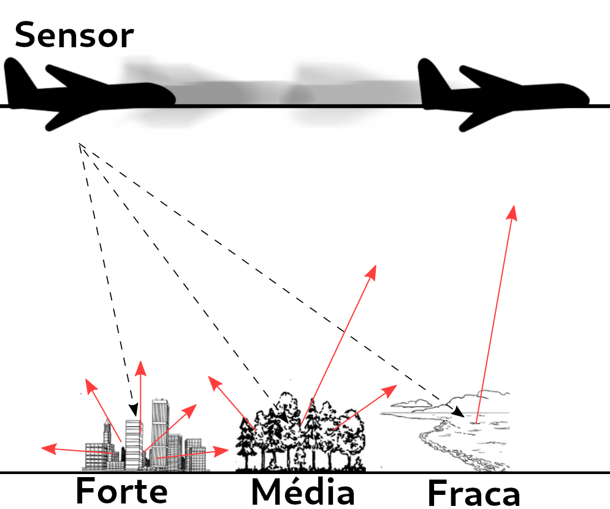{.relative width="55%"}

:::
::::

----

## Introdução

* Radar de Abertura Sintética (Synthetic Aperture Radar - SAR)
geralmente são estão acoplado a uma plataforma que transmite
micro-ondas ao longo de sua rota planejada em direção a um cenário geográfico;

* Pulsos são emitidos em direção ao cenário e o radar recebe os sinais de retorno
que são processados para formar uma imagem, estes podem ser na polarização circular ou linear.

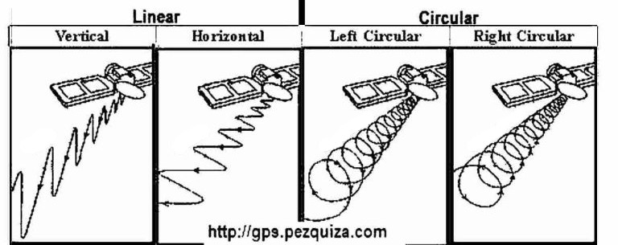{fig-align="center" width="50%"}

* Quando apenas um par de direções é usado, as imagens geradas são
chamadas de *SAR* monopolarizadas e, quando várias direções são usadas,
o processo é chamado de *PolSAR (SAR Polarimétrico)*;

---

## Introdução

 

<h4>Vantagens</h4>

* Images *SAR* podem ser obtidas de qualquer lugar (terra, mar, ar);
* a qualquer momento (dia ou noite);
* em quase todas as condições climáticas (nuvens, chuva);
* produzem imagens de alta resolução (alta largura de banda) das superfícies estudadas;

 
 

<h4>Desvantagens</h4>

* custo elevado para aquisição e manutenção dos satélites e radares;
* as imagens são afetadas por um ruído chamado *speckle*, que cria uma aparência granulada nas imagens, dificultando a interpretação e análise;

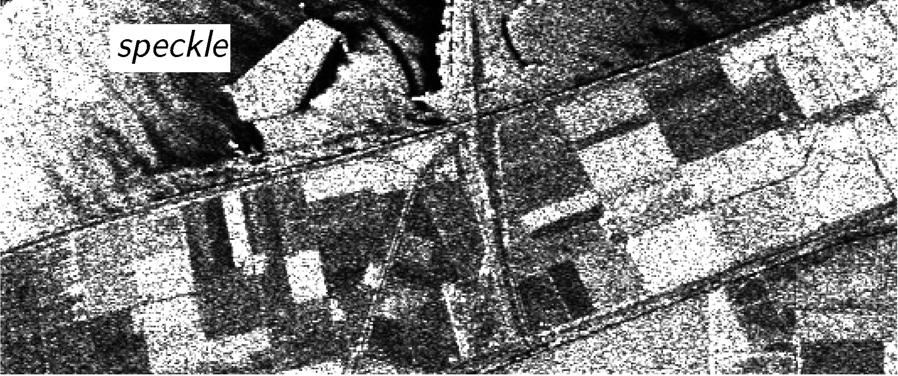

---

## Introdução

 

{fig-align="center"}

---

## Dados Polarimétricos *multi-look*

 

- Cada entrada de uma image PolSAR é associada com os elementos da seguinte matriz:
	
$$
\mathbf{S}=\left( \begin{array}{cc}
S_{hh} & S_{hv} \\
S_{vh} & S_{vv} \end{array} \right)
\label{matrizpolar}
$$

em que $S_{hh}$, $S_{hv}$, $S_{vh}$ e $S_{vv}$
são os coeficientes de espalhamento complexos do alvo para os respectivos canais de polarização, e os subscritos $h$ e $v$ representam a polarização horizontal e vertical, respectivamente, e,

$$
S_{rs} = A_{rs} e^{i \phi_{rs}} = \mathrm{Re}(S_{rs}) + i \mathrm{Im}(S_{rs})
$$

em que $\mathrm{Re}(S_{rs})$ e $\mathrm{Im}(S_{rs})$ são as partes real e imaginária do coeficiente de espalhamento, respectivamente, e $i$ é a unidade imaginária, $A_{rs}$ é a amplitude do coeficiente de espalhamento e $\phi_{rs}$ é a fase do coeficiente de espalhamento, para $r,s \in \{h,v\}$.

---

## Dados Polarimétricos *multi-look*

 

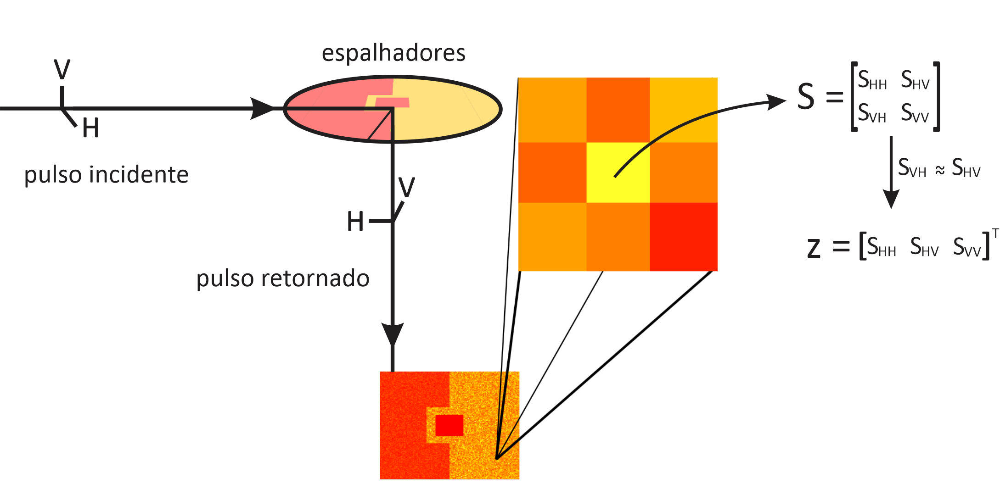{fig-align="center" width="40%"}

- Na prática, as polarizações cruzadas são muito semelhantes; ou seja, $S_{hv} \approx S_{vh}$.

----

## Dados Polarimétricos *multi-look*

 

- Dados PolSAR *single-look* não levam em conta o controle do efeito *speckle* sobre as imagens

. . .

- Um processo para contornar isso é chamado de processamento *multi-look*
	
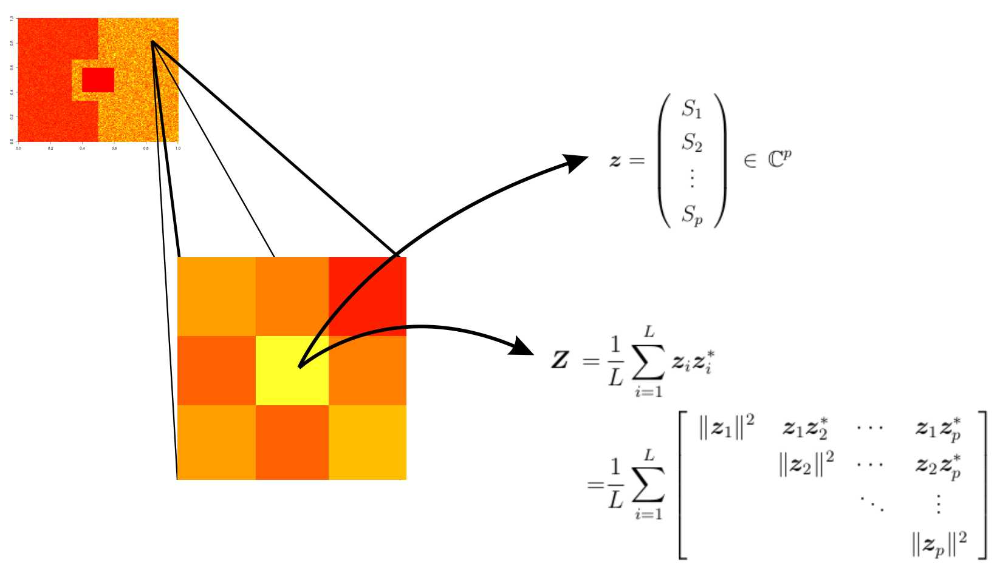{fig-align="center" width="40%"}

---

## Dados Polarimétricos *multi-look*

 

$\mathbf{z}_i = (S_1^{(i)}\,S_2^{(i)}\,\cdots\,S_p^{(i)})^{\top} \, \in \mathbb{C}^{p}$
é o $i$-ésimo vetor associado a $p$ canais de polarização em uma amostra de
$L$ informações extraídas da mesma cena, para $i=1,\ldots,L$.

{fig-align="center" width="40%"}

---

## Dados Polarimétricos *multi-look*

 

- Uma imagem *PolSAR* pode ser entendida como uma cena, na qual cada entrada está associada a uma matriz hermitiana definida positiva, o que requer o uso de métodos de processamento multivariado

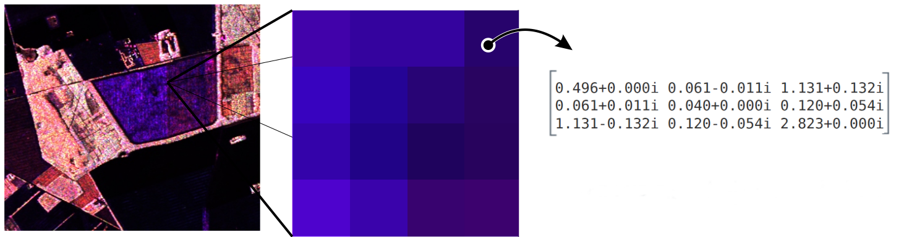{fig-align="center" width="40%"}

---

## Modelagem Estatística
<h4> Retroespalhadores</h4>

 

- Tomando apenas um canal de polarização,
sabe-se que se o número de espalhadores,
diga-se $n$, em uma célula de resolução
for grande o suficiente e aproximadamente constante entre diversos *pixels*,
então o sinal eletromagnético retornado

$$
S_{rs} = \sum_{k=1}^N S^{(k)}_{rs} = \sum_{k=1}^N  A_{rs}^{(k)} e^{i \phi_{rs}(k)},
$$

segue a lei Gaussiana complexa,
em que $S^{(k)}_{rs}$
é a quantidade de valor complexo que representa o espalhador individual.

---

## Modelagem Estatística
<h4> Retroespalhadores</h4>

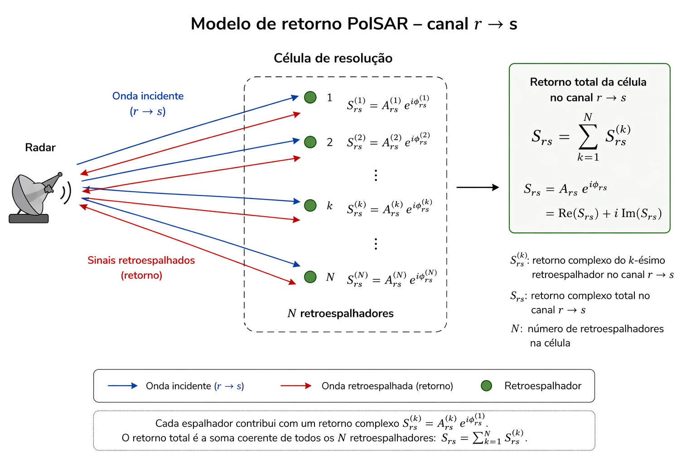{fig-align="center" width="40%"}

 

. . .

> Como o número de retroespalhadores mudam entre as células de resolução, é interessante que ele seja descrito como uma **variável aleatória**, diga-se $N$.

---

## Modelagem Estatística
<h4> Modelos da literatura e formulação física das novas propostas</h4>

 

- Há evidências de que a distribuição Wishart complexa pode representar o retorno *PolSAR* de cenários homogêneos.

 

- As distribuições Poisson truncada e geométrica podem ser usadas para modelar a quantidade de sinais retornados em uma célula de resolução.

 

- Combinando essas duas evidências, propomos a soma aleatória da distribuição Wishart complexa com o número de termos seguindo as leis Poisson truncada e geométrica como dois descritores para o retorno de dados *PolSAR*.

----

## Modelagem Estatística
<h4> Novos modelos</h4>

 

Primeiramente, 
seja
$\mathbf{Z}_i\sim \mathcal{W}_{m}^{\mathbb{C}}(\mathbf{\Sigma},L)$ para $i=1,\ldots,N$
com função densidade de probabilidade

\begin{align}
  \begin{array}{lr}
f({\dot{\mathbf{Z}}_i}) =
  \frac{|{\dot{\mathbf{Z}}_i}|^{L-m}}{|\mathbf{\Sigma}|^L\Gamma_m(L)}
\exp \left\{ - \operatorname{tr} \left(\mathbf{\Sigma}^{-1}{\dot{\mathbf{Z}}_i} \right)  \right\}
 \, \mathbb{I}_{ \mathbf{ \Omega }_+ } ( \dot{ \mathbf{S} } )
  \end{array}
\end{align}

em que $\Gamma_m(L)$
é a função gama multivariada.
Então, seja
$\mathbf{S}_k=\sum_{i=1}^k\mathbf{Z}_i\sim \mathcal{W}_{m}^{\mathbb{C}}(\mathbf{\Sigma},kL)$
e
a matriz de coerência por célula
segue a soma composta
$$\mathbf{S}=\sum_{i=1}^N\mathbf{Z}_i$$ com
$N\sim \text{TPo}(\lambda)$,
logo a densidade é dada por

----

## Modelagem Estatística
<h4> Novos modelos</h4>

 

\begin{align*}
  \begin{array}{lr}
  \begin{array}{rl}
f({\dot{\mathbf{S}}})
&=\sum_{k=1}^\infty P(N=k)f_{\mathbf{S}_k}({\dot{\mathbf{S}}})\,\mathbb{I}_{\mathbf{\Omega}_+}(\dot{\mathbf{S}})
\\
&=
\left(\frac{1}{\mathrm{e}^\lambda-1}\right)
\sum_{i=1}^\infty\frac{\lambda^k}{k!}f_{\mathcal{W}_{m}^{\mathbb{C}}(\mathbf{\Sigma},kL)}({\dot{\mathbf{S}}})
\\
&=\left(\frac{\mathrm{e}^{-\operatorname{tr}\left(\mathbf{\Sigma}^{-1}{\dot{\mathbf{S}}}\right)}}{|{\dot{\mathbf{S}}}|^m\left(\mathrm{e}^\lambda-1\right)}\right)\sum_{i=1}^\infty\frac{\left(\lambda|\mathbf{\Sigma}^{-1}{\dot{\mathbf{S}}}|^L\right)^k}{k!\Gamma_m(kL)},
  \end{array}
  \end{array}
\end{align*}

 

em que ${\dot{\mathbf{S}}}=\{s_{i,j}\}$ é uma possível realização de ${\mathbf{S}}=\{S_{i,j}\}$.

 

Esta situação é denotada por
$\mathbf{S}\sim \text{CPT}\mathcal{W}_{m}^{\mathbb{C}}(\lambda,\mathbf{\Sigma},L)$.

----

## Modelagem Estatística
<h4> Novos modelos</h4>

 

Agora assuma que $N\sim \text{Geo}(p)$ e $\mathbf{Z}_i\sim \mathcal{W}_{m}^{\mathbb{C}}(\mathbf{\Sigma},L)$ para $i=1,\ldots,N$,
a matriz de coerência por célula segue a soma composta
 $\mathbf{S}=\sum_{i=1}^N\mathbf{Z}_i$ com densidade
 
\begin{align*}
  \begin{array}{lr}
  \begin{array}{rl}
f({\dot{\mathbf{S}}})
&=\sum_{k=1}^\infty P(N=k)f_{\mathbf{S}_k}(\dot{\mathbf{S}}) \mathbb{I}_{\mathbf{\Omega}_+}(\dot{\mathbf{S}})
\\
&=
\left(
\frac{
	p\mathrm{e}^{-\operatorname{tr}\left(\mathbf{\Sigma}^{-1}{\dot{\mathbf{S}}}\right)}
}{
	(1-p)|{\dot{\mathbf{S}}}|^m
}
\right)
\sum_{k=1}^\infty
\frac{
	\left((1-p)|\mathbf{\Sigma}^{-1}{\dot{\mathbf{S}}}|^L\right)^k
}{
	\Gamma_m(kL)
}\,\mathbb{I}_{\mathbf{\Omega}_+}(\dot{\mathbf{S}}).
  \end{array}
  \end{array}
\end{align*}

 

Essa situação é denotada como $\mathbf{S}\sim \text{CG}\mathcal{W}_{m}^{\mathbb{C}}(p,\mathbf{\Sigma},L)$.

----

## Modelagem Estatística
<h4> Novos modelos</h4>

 

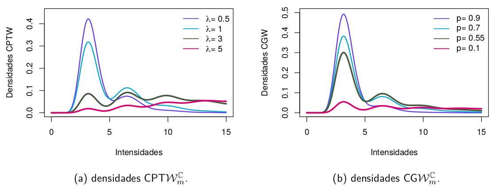{fig-align="center" width="60%"}

 

* Os EMVs para os parâmetros para as ditribuições
$\text{CPT}\mathcal{W}_{m}^{\mathbb{C}}$ e  $\text{CG}\mathcal{W}_{m}^{\mathbb{C}}$ foram obtidos
por meio do algoritmo EM.

----

## Modelagem Estatística
<h4> Novos modelos</h4>

 

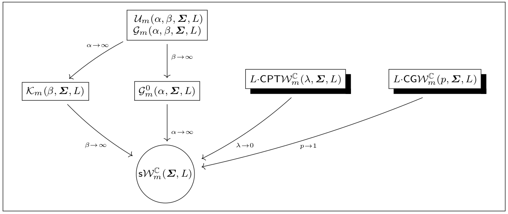{fig-align="center" width="60%"}

----

## Resultados
<h4>Análise de dados reais</h4>

 

{fig-align="center" width="60%"}

----

## Resultados
<h4>Análise de dados reais</h4>

 

{fig-align="center" width="60%"}

---

## Resultados
<h4>Análise de dados reais</h4>

 

{fig-align="center" width="60%"}

---

## Resultados
<h4>Análise de dados reais</h4>

 

{fig-align="center" width="60%"}

---

## Resultados
<h4>Análise de dados reais</h4>

 

{fig-align="center" width="60%"}

---

## Resultados
<h4>Análise de dados reais</h4>

 

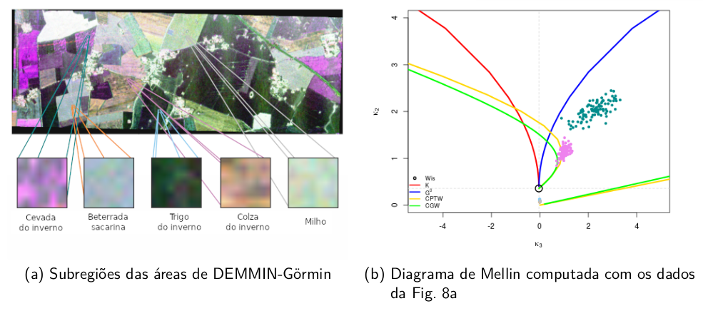{fig-align="center" width="60%"}

---

## Conclusões

 

- Foram propostas novas distribuições para dados *PolSAR multilook* usando a abordagem de soma estocástica para descrever dados multimodais.

- Elas foram denominadas como composta Poisson truncada Wishart complexa ($\text{CPT}\mathcal{W}^\mathbb{C}_m$) e composta geométrica Wishart complexa ($\text{CG}\mathcal{W}^\mathbb{C}_m$).

- Algumas propriedades matemáticas das distribuições são derivadas, tais como as funções características (fc) e cumulantes de Mellin.

- Novos mecanismos de estimação por máxima verossimilhança via algoritmo *EM (Expectation-Maximization)* são derivados e avaliados por experimentos Monte Carlo.

---

## Conclusões

 

Esses resultados podem ser encontrados no artigo publicado na
 **Remote Sensing**:

{fig-align="center" width="550"}

<!--   -->
<b>Autores:</b> Ferreira, J.A., Nascimento, A.D.C. \&  Frery, A.
 
<b>Ano:</b> 2022 - <b>DOI (link):</b> <a href="https://doi.org/10.3390/rs14205083" target="_blank">10.3390/rs14205083</a>

----

## Referências

 

- Ferreira, J.A.; Nascimento, A.D.C.; Frery, A.C. PolSAR Models with Multimodal Intensities. Remote Sens. 2022, 14, 5083.

- Anfinsen, S.N.; Doulgeris, A.P.; Eltoft, T. Goodness-of-Fit Tests for Multilook Polarimetric Radar Data Based on the Mellin
Transform. IEEE Trans. Geosci. Remote Sens. 2011, 49, 2764 –2781.

- Nascimento, A.D.; Rêgo, L.C.; Nascimento, R.L. Compound truncated Poisson normal distribution: Mathematical properties and
Moment estimation. Inverse Probl. Imaging 2019, 13, 787–803.

- Freitas, C.C.; Frery, A.C.; Correia, A.H. The Polarimetric G Distribution for SAR Data Analysis. Environmetrics 2005, 16, 13–31.

- Lee, J.S.; Schuler, D.L.; Lang, R.H.; Ranson, K.J. K-distribution for multi-look processed polarimetric SAR imagery. In Proceedings
of the International Geoscience and Remote Sensing Symposium (IGARSS’1994), Pasadena, CA, USA, 8–12 August 1994; Volume 4,
pp. 2179–2

-------

 

:::: {.columns}

::: {.column width="60%"}

<h3 style="font-size:30pt">Contato:</h3>

**e-mail**: <jodavid.ferreira@ufpe.br>

**Site Pessoal**: <https://jodavid.github.io/>

**Lattes**: [http://lattes.cnpq.br/4617170601890026](http://lattes.cnpq.br/4617170601890026)

**LinkedIn**: [jodavidferreira](https://www.linkedin.com/in/jodavidferreira/)

:::

::: {.column width="40%"}

<!-- {.relative fig-align="center" width="800"}

Computational Agriculture Statistics Laboratory - UFPE

 -->

:::
::::

{.relative fig-align="center" width="700"}

<!--

 <h1 style="text-align: center;">

OBRIGADO!

</h1> -->

::: {style="text-align: center; margin-top: -50px;"}

Slide produzido com [[quarto]](https://quarto.org/) + [[R]](https://www.r-project.org/)
:::
